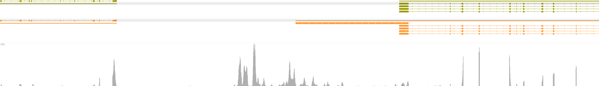

# GeneExt - Gene extension for improved single-cell RNA-seq data counting   

# Table of Contents
1. [Installation](#installation)
2. [Manual](#Manual)
3. [Tutorial](#Tutorial)
4. [FAQs](#faqs)

# Installation  

Dependencies:  
* `macs2`  - not needed if you already have the peaks  
* `bedtools`
* `samtools`
* python `gffutils`  
* python `numpy`  
* python `pysam`  
* python `rich`  
* python `pandas`


These dependencies can be installed with `conda` or `mamba`: 

```
# create environment
conda create -n geneext
conda activate geneext
# install dependencies
conda install -c bioconda -c conda-forge gffutils bedtools numpy macs2 samtools pysam rich pandas 
```


# TL;DR  Run
Once you have dependencies installed, you can try running `GeneExt`:  
```
python geneext.py -g [genome .bed/.gtf/.gff] -b [10x.bam] -o [output name]
```
__CAVE:__ Please, first test whether the tool works properly on test data! 

For details and troubleshooting, please refer to the manual.